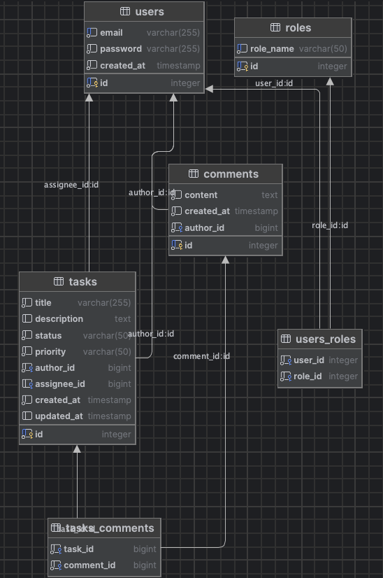

# Тестовое задание
# REST API для task manager

# Запуск

### Для запуска необходимо прописать команду
> docker-compose up
### После того как поднимутся контейнеры с приложением, бд, пгадмином, можно пробовать заходить

### Для просмотра доступных методов 
> http://localhost:8080/swagger-ui/index.html

### Для администрирования бд
### Креды для входа admin@admin.ru admin
>http://localhost:5050
### Коннект к бд
> host name: service-db
> port: 5432
> password: postgres
> user: postgres
> maintenance db: tm

### Тесты сделаны на тестконтейнере и не влияют на бд, перед работой с методами, следует придумать email и пароль, прокинув их в боди запроса по урлу 
> http://localhost:8080/registration
### Потом получить jwt (живет 50 минут)
> http://localhost:8080/auth

### Все, создавать задачи, смотреть, редактировать, добавлять комментарии и т.д
### Для получения доступа администратора необходимо в pgadmin изменить таблицу users_roles.

## Структура бд

 

